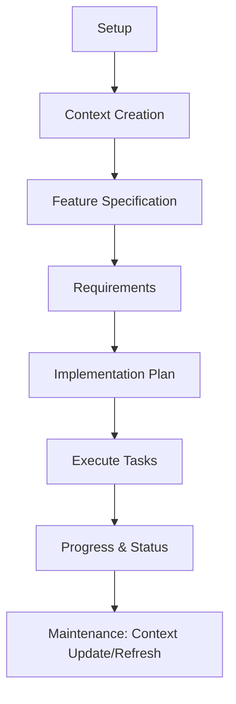

# codex-spec

Specification-driven development workflows for AI coding. codex-spec turns intent into executable specs and plans, then guides consistent implementation with context-aware commands.

## Why

AI is great at generating code, but results can be inconsistent without clear intent and shared context. codex-spec makes specifications the source of truth so you can:

- Align teams on intent before coding
- Preserve evolving project context (product, tech, structure)
- Generate detailed requirements and plans automatically
- Execute tasks with dependency awareness and progress tracking

This reduces rework, accelerates delivery, and keeps documentation in lockstep with the codebase.

## Workflow Diagram



## Installation

Prerequisites:

- Node.js >= 16
- OpenAI API key (environment variable `OPENAI_API_KEY`)

Install globally:

```bash
npm install -g codex-spec
```

Set your API key:

```bash
export OPENAI_API_KEY=your_api_key_here
```

Optional: If you use the Codex CLI locally, ensure it is installed and available on PATH.

## Quickstart

Initialize project context (product, tech, structure):

```bash
codex-spec context-setup --force
```

Create a feature specification:

```bash
codex-spec create "User onboarding" "Signup, verification, and first-run experience"
```

Generate detailed requirements and a plan with tasks:

```bash
codex-spec requirements
codex-spec plan
codex-spec plan-summary
```

Execute a task and track progress:

```bash
codex-spec execute task-1
codex-spec status
```

Maintain up-to-date context:

```bash
codex-spec context-update --auto
codex-spec context-refresh
```

## Commands

- `context-setup`:
  - Initialize `.codex-specs/context/product.md`, `tech.md`, `structure.md`
- `context-update [component]`:
  - Update product/tech/structure context (use `--auto` to diff recent changes)
- `context-refresh`:
  - Regenerate context files from scratch
- `create <feature-name> [description]`:
  - Create a comprehensive feature specification
- `requirements [spec-name]`:
  - Generate requirements from the specification
- `plan [spec-name]`:
  - Create the implementation plan and extract tasks to `.codex-specs/<spec>/tasks.json`
- `execute <task-id>`:
  - Execute an implementation task with context and plan guidance
- `execute-phase <phase>`:
  - Execute all tasks in a specific phase
- `status` / `plan-summary`:
  - View progress and plan overview

## Project Files

Key directories created in your repo:

```
.codex-specs/
├── context/
│   ├── product.md
│   ├── tech.md
│   └── structure.md
└── <feature-name>/
    ├── specification.md
    ├── requirements.md
    ├── plan.md
    └── tasks.json
```

## Configuration

- Requires `OPENAI_API_KEY`
- Works in any Git project; `--auto` context updates use `git diff`
- Defaults are sensible; commands expose `--help` for options

## Troubleshooting

- Command hangs or errors when running tasks: ensure the `codex` CLI (if you use it) is installed and available on PATH; otherwise the tool will use the OpenAI API for generation and planning.
- API errors: verify `OPENAI_API_KEY` and network connectivity.

## Design & Requirements

- Product Requirements: [`design/codex_spec_product_requirements.md`](design/codex_spec_product_requirements.md)
- Technical Design: [`design/codex_spec_workflow.md`](design/codex_spec_workflow.md)

## License

MIT
